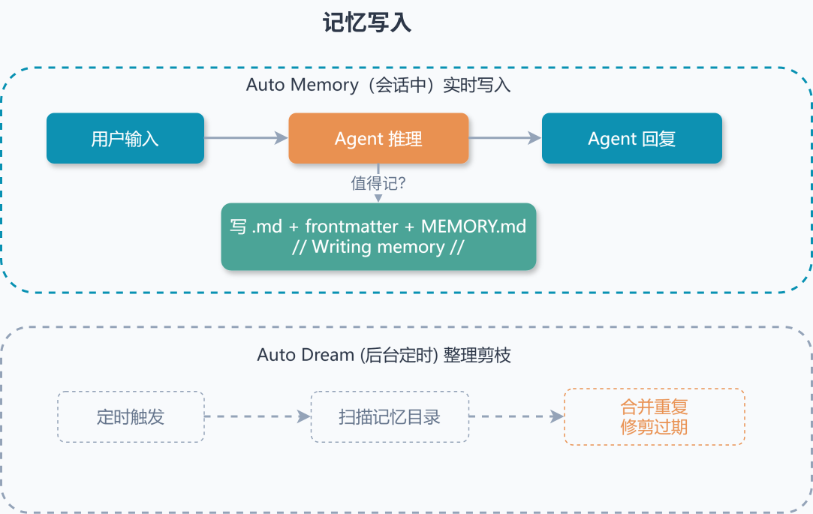
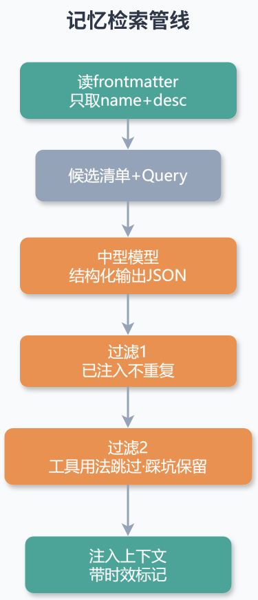
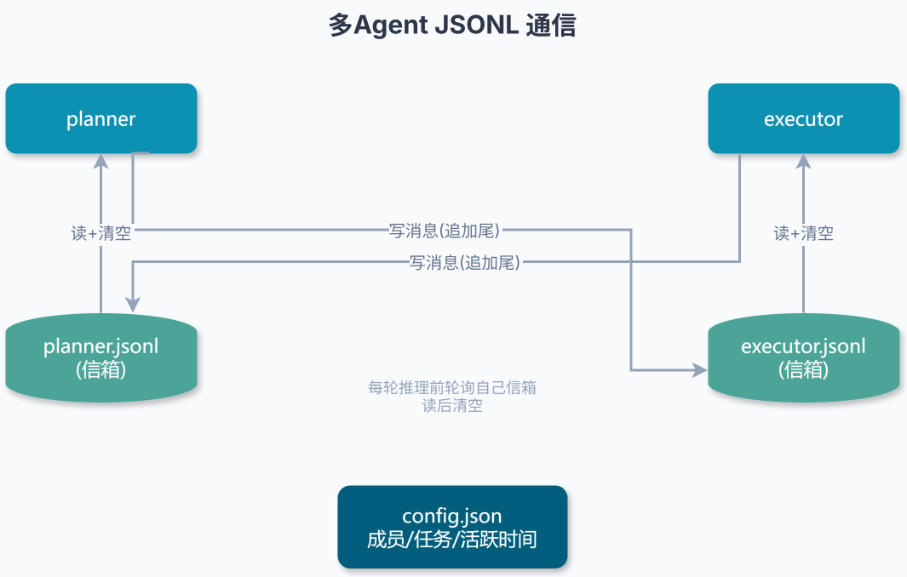

<!-- @include: @article-header.snippet.md -->

之前看到一个团队给 Agent 项目做记忆的案例，他们是直接上了一套完整的向量检索链路（Qdrant + embedding + reranker），部署都折腾了三天。结果跑了两周，团队反馈最多的一句话是"它记了一堆没用的，真正该记的一个没记住"。后来把记忆简单改成几个 Markdown 文件手动维护，效果反而好了不少。

这其实和 Claude Code 的思路一致。它没上向量数据库，没有碰 embedding，整套记忆仅仅只靠 Markdown 文件加一个中型模型做相关性筛选，但实际表现比多数向量检索方案更稳。

> 说明：Claude Code 核心并未开源，下文涉及的路径、常量名、模型档位等多是基于公开行为和文档的推断与归纳，不一定字字对应源码；数值类限制（如 200 行、25KB）则与社区观察一致，请按"示意"理解。

本文和 [《AI Agent 记忆系统》](./agent-memory.md) 互为补充：那篇讲通用理论和主流产品对比，这篇只拆 Claude Code 这一个产品，主要看这四个问题：

1. 那么多信息，Agent 到底该记什么
2. 几百条记忆，怎么塞进上下文又不爆窗口
3. 一百条候选，怎么挑出真正相关的几条
4. 几天前的记忆，现在还该不该信

## LLM 本身是无状态的

这里先说清楚一个前提：大模型推理本身是"无状态"的，一轮请求进来，再吐一个回复出去，模型供应商那边的进程里不留东西。它就好像是一个函数，你给它一个输入，它就给你一个输出。

你在豆包、通义这些 ChatBot 上跟它聊很久，感觉它好像"记得"前面说过的话，这其实因为是客户端把之前的对话又原样发了一遍。模型每轮拿到的输入，是固定的系统提示词、之前累积的对话、以及用户这轮新发的话拼起来的，这三部分加起来不能超过上下文窗口的 token 上限。

在纯聊天这个量级下模型的上下文窗口还能撑挺久，但是换到 Agent 场景就不同了。一次任务可能要连续发起十几次工具调用，每一步的返回都往上下文里堆，几轮下来配额就吃光了。

更关键的在于，Agent 需要知道什么才是应该长期记住的东西。比如你上周交代过"这个项目跑在 Java 21 上，别生成 Java 8 语法"，这周开个新会话，期待它直接照办——这种跨会话生效的规则、偏好、约定，才是记忆系统要管的，它的生命周期远超任何一次对话。

所以记忆系统真正要做的就那么几件事——存什么、放哪、过期了怎么办、谁来写谁清。

## Agent 到底该记什么

让 Agent 自己写记忆，第一个要回答的问题是：让它写什么？

最直觉的答案是"记下对用户有用的就行"。但"有用"是个模糊到没法落地的标准。

如果你不加约束，Agent 会往记忆里塞各种即时的、看起来有用的信息——这一轮调了哪些工具、当前文件多少行、这次会话在排查什么 bug。这些内容虽然看起来有用，实际上要么这一轮说完就作废，要么代码库里一查就有，存下来对后续决策零帮助。如果就这样低质量地日积月累，记忆目录会被低价值内容稀释，真正有用的偏好反而被埋在里面捞不出来。

**记什么类型的数据？**

Claude Code 的做法是划定一个极窄的分类边界：**记忆只能属于四种预定义类别之一，其余内容不允许写入持久化存储**。

| 类型          | 记什么                           | 典型内容                                        |
| ------------- | -------------------------------- | ----------------------------------------------- |
| **user**      | 用户身份、技术栈、熟练度         | "主力 Java 后端，前端只碰过一点 Vue"            |
| **feedback**  | 用户纠正过的偏好、确认有效的做法 | "集成测试要连真实 MySQL，别用 H2 内存库"        |
| **project**   | 项目当前的状态、约束、节点       | "支付模块 6 月 20 日上线后进入观察期，暂停合入" |
| **reference** | 某类信息去哪查                   | "线上慢查询归档在内部 Wiki 的 db-slow-log 页面" |

为什么这样设计？一个分类系统如果允许使用者随时自创标签，迟早会陷入熵增的陷阱——今天它把一条偏好归到「调试习惯」，明天把类似的归到「工作流」，后天又造个「个人风格」。标签只增不减，语义边界越来越模糊，到头来同一条信息散落在三四个标签下，检索时得逐个翻一遍。Claude Code 把门关死在四个类别，等于强制每条信息只能落在这四个固定槽之一。灵活性确实是少了点，但换来的是分类空间恒定、可预测——Agent 知道该去哪个类型里找，不用猜对方随手创了什么标签。

其中 `feedback` 和 `project` 有强制结构，正文必须交代三件事：规则本身、**Why**（用户为什么这么要求，往往踩过坑）、**How to apply**（什么情况下生效）。

**只记结论不记来由，碰到边界情况就抓瞎。**

比如"集成测试别用 H2"这条，单看字面，遇到一个需要验证并发事务行为的 case，Agent 可能就犯难——到底能不能破例？这时候如果补上 Why："H2 默认的事务隔离级别和 MySQL 不同，H2 上跑不出并发脏读，换到生产环境就会暴露"，Agent 就能自己掂量这次该不该通融。

`project` 还多一条硬要求：**相对时间必须换算成绝对日期**。用户随口一句"月底前别动订单模块"，写进记忆时就得固化成"2026-06-30 前禁止改订单相关代码"。"月底"这三个相对时间在过了一段时间后就会成漏洞，绝对日期不会。

**"该存什么"配套的是一道反向禁令。**

凡是当下伸手就能查到的，一律不进记忆。代码长什么样、目录怎么摆，命令行一扫就清楚；谁动过哪行，版本库自己记得比谁都牢；某个 bug 当初怎么修的，答案在补丁和提交说明里就能看见。这些信息都是"活的"，记忆落盘那刻就定格，两者注定会脱节。一条对不上的旧记忆如果没被及时清掉，模型会把它当成既定事实照着用。这种隐蔽的误导，事后排查非常费劲。

这条"不该存"清单背后是个很现实的权衡：维护一条记忆的成本，不只是它占的几十个 token，更在于一旦它过时，谁来发现、谁来删。

## 几百条记忆，怎么塞进上下文又不爆窗口

假设你积攒了 50 条记忆，怎么让模型知道有这些可用？最直觉的做法是全部塞进系统提示词。但你算一下，50 条每条 200 字，就是 1 万字、几千 token，系统提示词直接被记忆撑爆。反过来完全不塞，那模型根本不知道有这些记忆可用，写了等于白写。

Claude Code 的答案是和 Skill 机制类似的做法：**索引和正文分开加载**，我觉得也可以叫做**渐进式披露**。Claude Code 真的是把这个机制处处用到了极致。

每条记忆是一个独立的 `.md` 文件，带 YAML frontmatter（文件头部那段元数据）：

```yaml
---
name: feedback-no-h2
description: 集成测试连真实 MySQL，不用 H2 内存库
metadata:
  type: feedback
---
集成测试必须连真实 MySQL，禁止用 H2 内存库代替。

**Why:** 之前用 H2 跑通的 case，上线后因为 MySQL 默认的事务隔离级别和 H2 不同，并发场景下出现了脏读
**How to apply:** 所有打上"集成测试"标签的 case 都按这个标准
```

所有记忆文件放在 `~/.claude/projects/<project>/memory/` 目录下，目录里有一个特殊的 `MEMORY.md` 文件，是所有记忆的索引清单。这个目录按 git 仓库隔离——同一个 repo 的所有 worktree、所有子目录共用一份记忆；但它是机器本地的，换台电脑、上个云环境，记忆不会跟着走。

`MEMORY.md` 索引始终加载进上下文（让 Agent 知道有哪些记忆可选），完整内容按需加载（不浪费 token）。Agent 看到索引中的 name 和 description，就知道有哪些可供选择；真正需要某条的完整内容时，再去读取对应的文件。

`MEMORY.md` 有两道硬上限：前 200 行或 25KB，哪个先到就截断。光卡行数会漏一种情况——某条记忆的 description 塞了一大段超长字符串，行数没超但体积惊人。所以两道闸一起下：

```text
MAX_ENTRYPOINT_LINES = 200
MAX_ENTRYPOINT_BYTES = 25_000
```

任意一道触发就切掉多余部分，并在末尾追加提示，告诉模型"这个索引被截过了，后面还有内容没读进来"。

那记忆是怎么写进去的？

主 Agent 在会话进行中 Auto Memory **就地写**。当用户说出值得记的偏好或纠正（比如"以后集成测试都连真实 MySQL"），或者 Agent 自己判断某条信息值得沉淀，它就直接调文件工具把记忆落盘，写完顺手在 `MEMORY.md` 索引里补一行指针。你在界面看到"Writing memory"的提示，就是这一刻。整个过程不需要等会话结束，也没有另一个代理在背后扫描。

真正放到后台跑的，是另一件事——**整理和剪枝**。记忆写多了会重复、会过时，社区把这个后台过程叫 Auto Dream：它会定期扫一遍记忆目录，把表述重复的合并、把跟现有代码库对不上的旧条目挑出来。注意这不是"抽取新记忆"（那是会话内当场干的），而是"收拾已有的记忆"，防止目录越积越脏。整个流程分为四步——定向（扫一遍记忆目录）、搜信号（翻历史 JSONL 日志，重点找纠正和决策）、巩固（合并重复、解决矛盾、把”昨天/下周”替换成绝对日期）、修剪索引（删过时和冗余）。整个过程隔离在记忆目录里，项目代码只读碰不了。



## 一百条候选，怎么挑出真正相关的几条

下次对话来的时候，假设有 100 条记忆，怎么挑出最相关的几条？

Claude Code 没走向量检索这条路。它把相关性判断整个交给一个中型模型，过程其实不复杂。

先是**收集候选**：逐个读记忆文件的 frontmatter，拿到每条记忆的 name 和 description，完整正文先不碰。这样哪怕有几百条记忆，扫描开销也很轻。

然后是**构造提示**：把这些摘要信息组织成一份候选清单，连同用户当前的问题一起提交给中型模型：

```text
Query: 用户当前的问题

Available memories:
- user-stack.md — 主力 Java 后端，前端只碰过 Vue
- feedback-no-h2.md — 集成测试连真实 MySQL，不用 H2
- project-pay-freeze.md — 支付模块 6-20 上线后暂停合入
...
```

最后是**结构化输出**：要求模型严格按照预定义的 JSON 格式返回它认为最相关的若干条记忆的文件名。系统提示词在这里卡得很死，拿不准的就不选，宁缺毋滥。

筛选用的是偏精度档位的模型，没贪最便宜的那档。

因为筛记忆比生成回答更吃准度——生成答错了，用户能看出来纠正；筛错一条记忆塞进上下文，模型会拿它当既定前提往下走，错得悄无声息。这种隐性偏差一旦发生，调试链路很长，远比模型档位差的那点钱难处理。

检索阶段还有两道过滤。

第一道，本轮已经注入过的记忆不再重复塞，把注入配额让给还没露过面的新候选。

第二道针对工具：如果 Agent 这会儿正在调用某个工具，那这个工具的"用法说明"类记忆就不选——它已经在实际操作了，再补一份说明书纯属噪音；但工具相关的"踩过的坑""已知缺陷"会破例保留。这类避雷信息的价值高度依赖时机：注入太早，Agent 还没碰这个工具，记下来也是噪声；等真用上了又没提醒，可能已经踩进去了。所以系统选择在 Agent 正接触该工具的节点把它保留下来。



## 几天前的记忆，现在还该不该信

记忆选出后，Claude Code 通过特殊的系统标签把它注入对话上下文，和用户消息明确分隔，防止模型混淆信息来源。

注入时附带的**时效性标记**值得注意：

```text
This memory was saved 5 days ago. Verify it's still accurate before acting on it.
```

被召回的记忆，注入时往往带着这类"先核对再用"的提示。代码库改动频繁，一条几天前写入的状态描述，很难保证此刻仍然成立。模型读到带标记的记忆，心态上会把它当成"历史档案"而不是"现况陈述"，用到前先去核对。

顺着这条思路，系统提示还会反复叮嘱模型：记忆落盘那刻的代码库，未必等于现在这刻的代码库。凡是点着具体文件、配置位置的那些条目，动手前必须回代码里核实还在不在；用户要是打算照着记忆里的说法直接改东西，更得先核对再落地——记忆只指方向，不打包票。

这其实是个分寸问题：把记忆当成铁定的现况，代码库一动就会带偏决策；可要是每次都不信、什么都重新查一遍，记忆系统又白做了。Claude Code 卡在中间——记忆负责指个大概方向，真相同刻以代码库为准，用之前对一遍账。

有个维度值得注意：记忆的类型决定了信任的合理程度。讲"当年为什么这么选"的那类（比如"缓存用 Caffeine 而不是 Redis，是为了避开序列化开销"），交代的是动机不是现状，基本不会过期，可以直接采信。指向具体代码位置的那类（比如"订单超时的定时任务挂在 order-job 里"），一次重构就可能挪窝，用之前必须回代码里核对。

## 记忆的另一条线：CLAUDE.md

前面讲的四类记忆，是 Agent 自己在协作过程中沉淀的。但还有一类信息是开发者预先写好的规则和约束——这就是 CLAUDE.md。它和前面讲的 auto memory 是两套并列的系统：auto memory 由 Agent 自己写，CLAUDE.md 由人写；两套都每次启动加载，职责却分开——CLAUDE.md 管协作规范和项目约束，内容是确定的，不需要 Agent 去猜。

很多人以为 CLAUDE.md 就是项目根目录放一个 md 文件。实际上 Claude Code 按加载顺序把它分成四个层级，从全局到局部依次叠加：

| 层级        | 位置                                   | 作用范围                                                |
| ----------- | -------------------------------------- | ------------------------------------------------------- |
| **Managed** | 系统级路径                             | 组织内所有用户，公司编码规范、安全策略                  |
| **User**    | `~/.claude/CLAUDE.md`                  | 个人所有项目，代码风格偏好、个人工具习惯                |
| **Project** | `./CLAUDE.md` 或 `./.claude/CLAUDE.md` | 团队共享，项目架构、编码标准，提交至 Git                |
| **Local**   | `./CLAUDE.local.md`                    | 个人当前项目，沙箱 URL、测试数据偏好，加入 `.gitignore` |

四层之间是叠加关系不是覆盖关系，越靠近工作目录的规则优先级越高。

这里有个反直觉的细节：CLAUDE.md 注入的位置不是系统提示词，而是系统提示词之后的一段 **user message**。这个差别决定了记忆的"软硬"——它是模型读到的一段上下文，不是被引擎强制的配置。多数时候模型会照办，但碰到模糊或冲突的指令，它可能挑一条自己觉得合理的执行，甚至忽略。这也解释了为什么一条过时的记忆能悄悄带偏决策：在模型眼里，它和用户当场说的话没什么两样。

那要真正的硬规矩怎么办？别指望 CLAUDE.md，上 **hook**。hook 在客户端层执行，不管模型怎么决定都拦得住——比如 PreToolUse hook 能在每次工具调用前硬挡掉某些命令。一句话：CLAUDE.md 和记忆负责"引导"模型，hook 负责"强制"行为，两者别混。

光分层还不够。假设你有一份几百行的前端规范，但只在编辑 `.tsx` 文件时才需要，编辑后端代码加载它就是浪费 token。Claude Code 在 `.claude/rules/` 目录下支持条件规则：每条规则是一个独立的 md 文件，frontmatter 里用 `paths` 字段做 glob 匹配，只有编辑匹配路径的文件时才加载。一个大项目可以有几十条规则，每条只在真正需要的时候才占用 token。

顺着这条思路，指令放哪有三档选择：每次会话都要的全局常驻规则放 CLAUDE.md；只在动某类文件时才需要的放 path-scoped rules；多步骤的可复用流程放 skill——按需触发，不常驻。同一个指令选错位置，要么白白占 token，要么该出现时没出现。

`@path/to/file` 引用语法也能引入外部文件，但有代价——被引用文件启动时全量展开进上下文，并不省 token，而且递归 import 最多四跳、首次引外部文件还会弹审批门。所以长指令优先用 path-scoped rules 按需加载，别用 `@` 拆分。

## 多 Agent 怎么通信

单个 Agent 管自己的记忆够用了。但多个 Agent 凑成一个团队协作时，问题变了：它们之间怎么传消息、怎么共享状态。这事归 **Agent Teams** 这个独立功能管，和前面讲的 auto memory 不是一套东西——auto memory 解决"记不记"，Teams 解决"怎么互相喊话"。Teams 的做法是基于文件的通信：每个成员有一个以自己名字命名的 JSONL 文件充当消息队列。

```text
.team/
  config.json       ← 团队成员清单，附带每个人的当前任务和最后活跃时间
  inbox/
    planner.jsonl    ← 新消息写到文件尾，读完后清空重开
    executor.jsonl
```

要通知别的 Agent，就把消息追加到对方的 JSONL 文件里；自己有没有新消息，打开自己的信箱文件看一眼就知道，读完清空，下一条从空文件开始写。每轮推理开始前，Agent 都会先这样查一次信箱，把新消息并进当前上下文。

整个通信过程结构化、可审计——打开 JSONL 文件就能看到完整的消息历史，出问题时追踪单条消息的来源很直接。

顺带一提，回到记忆这条线：每个 subagent 也能维护自己的一份 auto memory，和主 Agent 的记忆分开存放。所以一个团队里，既有成员间用 JSONL 传消息的协作通道，也有各自沉淀的经验记忆，两套互不干扰。



## Markdown 记忆和向量检索怎么选

看完整套实现，一个自然的问题是：它和向量检索到底各自适合什么场景？

| 维度         | Markdown + LLM 选择        | 向量检索               |
| ------------ | -------------------------- | ---------------------- |
| 检索精度     | 高（模型理解语义和上下文） | 中高（相似不等于相关） |
| 上下文成本   | 索引常驻，按需加载         | 按需检索，上下文高效   |
| 调试体验     | 极佳，打开文件就能看       | 中等，需要向量查询工具 |
| 部署成本     | 极低，只需文件读写         | 高，需维护向量服务     |
| 适合的记忆量 | 几十条到几百条             | 几万条到几十万条       |
| 可解释性     | 强（能看到选择依据）       | 弱（相似度分数难解释） |

Claude Code 选择 Markdown 方案的核心原因是：**Agent 记忆常驻索引的数量级通常在几十到几百条**，远没到需要向量检索的规模。哪怕实际记忆更多，超出 200 行的部分会被挪进 topic 文件按需加载——瓶颈在"怎么筛得准"，不在"存得下多少"。在这个量级下，让一个中型模型直接做相关性筛选，精度高过向量检索，成本更低，调试也顺手得多。

但如果你的场景是从几十万条非结构化文本里检索特定片段，向量检索的语义检索能力不可替代。两者不是二选一，而是各有适用边界。

## 能直接抄走的三条

写入这关比检索重要得多。多数人做记忆系统，劲儿都使在“怎么查得更准”，偏偏绕开“该不该存”。Claude Code 顺序反着来——先把写入卡死：四种类型加 frontmatter 加不该存清单，三道闸把垃圾挡在门外。检索再花哨，库里全是废水也榨不出东西。

索引和正文也得拆开。一份“有什么”的轻量目录常驻上下文，完整正文用到了才取。这套不限于记忆——长文档、工具说明书、历史 PR 摘要、API 清单，凡是“总量大、每次只用零头”的场景都吃得开。

还有时间戳，别当成可有可无的细节。记忆落盘那一刻就定格了，不会跟着代码库自己更新。给它标上保存时间，超过阈值就提示”先核对再用”，当 `git log` 那样的历史档案看，别当数据库的当前行。

## 回过头看：一套四层运转的系统

前面拆了那么久，整个记忆系统其实可以收成一张表：

| 层级               | 谁在管             | 存什么                                     | 生命周期                             |
| ------------------ | ------------------ | ------------------------------------------ | ------------------------------------ |
| **CLAUDE.md**      | 你手写             | 项目规范、编码标准、团队约定               | 永久                                 |
| **Auto Dream**     | 后台自动运行       | 整理、合并、修剪 Auto Memory，防止越记越脏 | 触发式（距上次 ≥24h 且累积 ≥5 对话） |
| **Auto Memory**    | Agent 协作中自动写 | 经验、偏好、决策、参考                     | 跨会话生效                           |
| **Session Memory** | 每次对话自动       | 当前对话的上下文，对话结束即释放           | 单次会话                             |

神经科学里有个对应的概念：人的记忆也是分层巩固的——海马体白天快速存（像 Auto Memory），晚上 NREM 睡眠回放给大脑皮层，REM 阶段做整合和选择性遗忘（像 Auto Dream）。Claude Code 的架构跟这套是同构的。它不会梦见电子羊，但它确实在你关掉窗口以后，悄悄把该留的留下来、该忘的忘掉。

## 记忆插件

前面聊的是 Claude Code **内置**的记忆系统。管”记住该记的”，精选几十到几百条，人工可审计。但如果你想**自动捕获所有对话细节**，或者**跨 LLM 共享记忆**，社区有四个值得一提的工具：

| 工具            | 定位        | 一句话                                                                                                                    |
| --------------- | ----------- | ------------------------------------------------------------------------------------------------------------------------- |
| **agentmemory** | 功能最全    | 12 个生命周期 hook 全自动捕获；BM25+向量+知识图谱三路融合检索；4 层记忆固化（工作→情景→语义→程序）；零外部依赖，单 SQLite |
| **claude-mem**  | 社区最火    | ChromaDB 向量库，6 个 hook 全自动，常驻守护进程带 Web 查看器——代价是 Bun+Python+ChromaDB 的重依赖链                       |
| **ECC**         | 不止记忆    | Claude Code 整体增强框架；记忆子系统只做跨会话状态保持（session start/compact/end 三阶段），不碰语义长期记忆              |
| **supermemory** | 跨 LLM 通用 | 云端 API，ChatGPT/Claude/Cursor 共用同一份记忆；无需安装，免费——但要信任云端                                              |

怎么选？一句话：内置记忆管质量（该记才记），社区工具管覆盖（什么都记），并且通常功能更多，记忆覆盖面更广。量级差一个数量级——内置的几十上百条精选，社区的几万条全量——选对场景才是关键。
