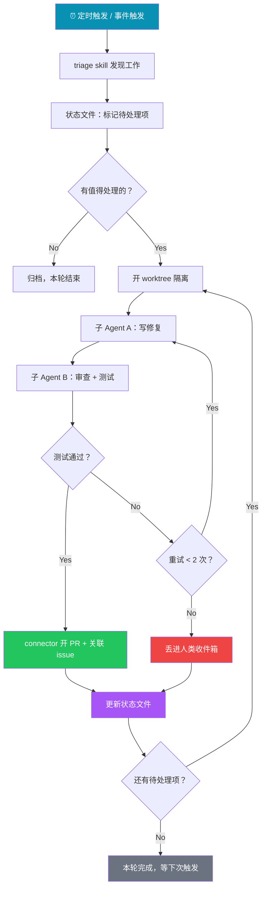

我最近遇到一件有意思的事。某个周一早上九点，打开电脑发现 overnight 有 12 个 PR 已经合入了 main 分支——代码质量检测、依赖升级、CI 失败修复，全都不是我手动发起的。我上一轮跟 Agent 的交互还停留在上周五下午，当时我只是给它设了一个目标："这周末把所有 CI 红灯灭掉"。

然后我意识到一件事：我已经两天没有"提示"过任何 Agent 了。

Peter Steinberger（OpenClaw 创始人，现就职 OpenAI）和 Boris Cherny（Claude Code 负责人，Anthropic）最近都说了几乎相同的一句话："我不再手动 prompt Agent 了，我设计 Loop。"

这话听着像鸡汤，但底下藏着一套真实的技术范式转移。这篇文章把这件事拆开讲清楚。全文接近 9000 字，建议收藏，主要看这几块：

1. 三层演进：从 Prompt 到 Context 到 Harness 到 Loop
2. Loop 到底是什么——和 cron job 及旧自动化的本质区别
3. 五大组件 + 记忆：Addy Osmani 的框架拆解
4. 落地示例：一个真实 Loop 长什么样（含流程图）
5. 什么时候该用 Loop：决策表
6. 前提、风险、成本和你的新角色
7. 动手：搭建你的第一个 Loop

## 三层演进：从写好一句话到设计一个系统

理解 Loop Engineering 之前，得先搞清楚它是从哪一步长出来的。

**Prompt Engineering** 解决的问题是：怎么把话说清楚，让模型一次做对。2023 年的主流玩法，写一段精心设计的指令，调几个参数，拿到结果。核心关注点在"怎么问"。

**Context Engineering** 往上走了一层。2025 年下半年，Andrej Karpathy 提出了这个词——瓶颈不是"怎么问"，而是"Agent 看到了什么"。一个 Agent 拿到错误的上下文，prompt 写得再好也会跑偏。所以这一层关注的是信息环境的管理——给 Agent 塞哪些文件、哪些历史、哪些工具的输出。LangChain 后来把它定义为"构建动态系统，以正确的格式提供正确的信息和工具"。拿做菜打比方，Prompt 是菜谱上写的那几句话，Context 是厨师手边摆着的食材和调料。

**Harness Engineering** 又高了一层。这个词的提出有争议：Viv Trivedy 和 Mitchell Hashimoto（HashiCorp 联合创始人）都被认为是提出者（Addy Osmani 明确归功于 Trivedy，另一些来源指向 Hashimoto 在 2026 年 2 月的提法）。无论谁是第一人，Addy Osmani 后来在 O'Reilly 和个人博客做了系统展开，Martin Fowler 也撰文讨论。它关注的是"Agent 在什么环境里跑"——权限控制、结果验证、失败回滚、文件隔离。公式很简单：**Agent = Model + Harness**。如果 Context 是食材和调料，Harness 就是厨房的管理制度：卫生标准、操作流程、出餐检查。一个厨师手边食材齐全（Context 好），但没有管理制度（Harness 差），照样会把厨房搞乱。

然后是 **Loop Engineering**。

| 层次 | 关注点 | 餐厅比喻 |
|------|--------|---------|
| Prompt Engineering | 怎么问 | 菜谱上写的那句话 |
| Context Engineering | Agent 看到什么 | 厨师手边的食材和调料 |
| Harness Engineering | Agent 在什么环境跑 | 厨房管理制度 |
| Loop Engineering | 谁来发起、谁来验收 | 餐厅运营系统 |

Loop 不和前三层竞争，它坐在它们上面。一个 Loop 内部用 Prompt 表达任务、用 Context 管理信息、用 Harness 保证安全——然后 Loop 自己决定什么时候发起任务、什么时候检查结果、什么时候停下来。

区别在哪？**控制权的交出程度不同。**

- Context Engineering：交出信息权（Agent 自己决定怎么用这些信息）
- Harness Engineering：交出过程权（Agent 自己决定怎么走完流程）
- Loop Engineering：交出发起权和验收权（Agent 自己决定要不要开始、算不算做完）

这就是为什么 Cherny 说"我的工作变成了写 Loop"——他不再坐在那里一条一条发指令，而是设计一整套运转系统。

## Loop 到底是什么

很多人听到"Loop"第一反应是：这不就是 cron job 吗？

不是。区别在一个关键的东西：**Loop 里面有决策者。**

cron job 跑固定脚本。凌晨三点执行 A，上午九点执行 B，永远不变。Loop 里面跑的是一个 Agent——它看当前状态，选择下一步动作，执行，检查结果，然后决定继续、重试、回滚还是停下。Agent 控制 Loop，不是脚本控制 Loop。

Louis-François Bouchard 在他的分析文章里把这个区分说得很清楚：

> A cron job runs a fixed script. A loop runs an agent that looks at the current state, chooses the next action, does it, checks the result, and decides what to do next.

要让一个 Loop 真正跑起来，需要两个前提条件：

**1. 触发器（Trigger）**

什么事启动这个 Loop。可以是定时（每天早上 7 点）、事件驱动（PR 被打开、CI 红了）、也可以是你手动敲一个命令。触发器让 Loop "醒过来"。

**2. 可验证的目标（Verifiable Goal）**

什么条件满足时 Loop 停下来。"所有测试通过且 lint 无报错"是一个好目标——确定性、可检查。"把这个功能做得更好"是一个坏目标——模糊、无法验证。

没有可验证目标的 Loop，Addy Osmani 说得很直接：**"你只是造了一个非常自信的 token 焚烧炉。"**

这就引出了一个重要的判断标准：**不是所有任务都适合 Loop。** 任务有明确的 pass/fail 信号？适合。任务需要创造性判断、方向不明确？不适合，手动做或者先想清楚目标再说。

### 和以前的自动循环有什么不同

如果你觉得"让 Agent 反复执行直到完成"听起来不新鲜，你是对的——也不对。

2024 年就有"Ralph Loop"（让 Agent 持续自主编码）和各种 agent loop 模式。区别在规模：老的循环就是"让 LLM 再跑一轮"，Loop Engineering 把循环变成了一个**工程单元**——它能定时调度、开 worktree、派子 Agent、把状态写到文件或看板、在你关上笔记本后继续跑。它能在没有你的情况下运转，所以它也应该能在没有你的情况下工作。

用一句话区分：自动化说"先做第一步，再做第二步，再做第三步"。Loop 说"看当前状态，决定下一步，执行，检查，再决定要不要继续"。一个是脚本，一个是微型工程流程。

正因如此，Louis-François 强调：Prompt engineering 优化单次交互，Loop engineering 把单次交互变成可重复流程——prompt 变成了更大系统里的一个组件。

## 五大组件 + 记忆

Addy Osmani（Google）在 2026 年 6 月 7 日发表了 [Loop Engineering](https://addyosmani.com/blog/loop-engineering/) 一文，把一个生产级 Loop 拆成了五个组件加上一个记忆层。这个拆解是目前我看到最清晰的。

有意思的是，Codex（OpenAI）和 Claude Code（Anthropic）这两款工具几乎在同一时间具备了这五个能力。下面的表格按组件逐一对照。

### 1. 自动化（Automations）——Loop 的心跳

自动化让 Loop 定时醒来、自己发现工作。没有它，Loop 就是你手动跑了一次的东西，不是真正的循环。

在 Codex 里，你在 Automations 面板选择项目、prompt、执行频率和运行环境，结果落进 Triage 收件箱。Claude Code 走的是另一条路：`/loop` 按间隔重复执行，cron task 定时调度，hooks 在 Agent 生命周期特定节点触发 shell 命令，或者直接推到 GitHub Actions 让它在你关上笔记本后继续跑。

还有一个进阶原语值得了解：`/goal`。它不是按时间循环，而是按目标循环——给一个可验证的条件，Agent 反复执行直到条件满足，每轮结束后用一个独立的小模型检查"做完了吗"。做的人不评，评的人不做。

### 2. 工作树（Worktrees）——并行不冲突

跑多个 Agent 时，文件冲突是头号问题。两个 Agent 同时改同一个文件的同一行，和两个工程师不沟通就 commit 同一段代码是一个问题。

git worktree 给每个 Agent 一个独立的工作目录和分支，共享同一个仓库历史。Codex 内置了这个能力。Claude Code 通过 `git worktree` 命令、`--worktree` 标志、以及 subagent 的 `isolation: worktree` 设置实现同样的隔离。

Addy Osmani 在他之前的文章里提过一个概念叫"编排税"（orchestration tax）：worktree 解决了机械冲突，但你的 review 带宽决定你实际能同时跑多少个——瓶颈是你，不是工具。

### 3. 技能（Skills）——不要每次重新解释你的项目

一个没有 Skills 的 Loop，每次启动都从零开始理解你的项目——构建命令是什么、代码风格是什么、为什么某个地方要特殊处理。每轮循环都在重新推导你已经知道的东西，白白烧 token。

Skill 是一个文件夹，里面放 `SKILL.md`，写入项目约定、构建步骤、踩过的坑。Codex 通过 `$skill-name` 或 `/skills` 调用，也能根据任务描述自动匹配。Claude Code 同样使用 `SKILL.md` 格式。

Louis-François Bouchard 特别强调了这一点：

> A loop with no reusable skills just rediscovers your project from zero every run. It burns tokens re-learning what you already know. A loop with good skills starts to compound.

一个技巧：把 skill 做得密集但单一——一个 skill 覆盖一个任务，不要塞太多内容撑爆上下文。然后建一个索引，让 Agent 自己查 skill 列表。

Addy Osmani 在另一篇文章里提出过一个概念叫**意图债务（Intent Debt）**：Agent 每次启动都是冷启动，它会在你意图的每一个空缺处填上一个"自信的猜测"。Skill 就是把意图写在外面——约定、构建步骤、"那个地方不能这样改因为去年踩过坑"——写一次，每轮都能读。冷启动的代价被压到接近零，Loop 才开始复利。

### 4. 插件和连接器（Plugins & Connectors）——让 Loop 进入真实环境

没有连接器的 Loop 只能操作文件系统。有了连接器（基于 MCP 协议），Agent 能读 issue tracker、查数据库、调 API、发 Slack 消息。

这是 Loop 和"Agent 给你建议"的关键分水岭。没有 connector，Agent 只能说"这是修复方案"。有了 connector，Loop 能自己开 PR、关联 Linear ticket、CI 绿了之后通知频道。区别在于是"告诉你怎么做"还是"直接做了"。

Codex 和 Claude Code 都支持 MCP，给一个写的 connector 通常两个都能用。

### 5. 子 Agent（Sub-agents）——做事的人和检查的人分开

Loop 里面最有价值的架构决策，是把写代码的 Agent 和审代码的 Agent 拆开。

原因很直觉：给自己写的代码打分的模型，打分太宽松。一个带着不同指令（有时用不同模型）的第二 Agent，能抓住第一个 Agent 自己骗自己的问题。

Codex 用 `.codex/agents/` 目录下的 TOML 文件定义子 Agent——名字、描述、指令、可选的模型和推理强度。安全审查可以用强模型高推理，探索任务用轻模型快速跑。Claude Code 用 `.claude/agents/` 和 agent team 实现同样的分工。

子 Agent 会消耗更多 token，所以要把第二意见花在值得检查的地方。这也正是 Claude Code 的 `/goal` 底层在做的事：用一个新模型判断 Loop 是否完成，而不是让做任务的那个模型自己说"我做完了"。

### 6. 记忆（State/Memory）——第六个组件

模型会忘记，仓库不会。

Loop 的状态需要持久化到磁盘——一个 markdown 文件、一个 Linear 看板，任何对话之外能记住"做了什么、什么通过了、什么还开着"的东西。明天早上 Loop 启动时，能接着昨天的地方继续，而不是从头来。

| 组件 | 职责 | Codex | Claude Code |
|------|------|-------|-------------|
| **Automations** | 定时发现 + 分拣 | Automations 面板 | `/loop`、`/goal`、cron、hooks、GitHub Actions |
| **Worktrees** | 隔离并行 | 内置 per-thread | `git worktree`、`--worktree`、`isolation: worktree` |
| **Skills** | 固化项目知识 | `SKILL.md`、`$name` 调用 | `SKILL.md` |
| **Connectors** | 连接外部工具 | MCP connectors | MCP servers |
| **Sub-agents** | 分工 + 互相审查 | `.codex/agents/` TOML | `.claude/agents/`、agent teams |
| **State** | 记录进度 | Markdown / Linear | `AGENTS.md` / Linear via MCP |

## 落地示例：一个真实 Loop 长什么样

拼起来看一个完整场景。这是一个"每日自动维护" Loop 的运行方式：

**触发**：每天早上 7 点，自动化启动，调用一个 triage skill。

**发现**：skill 读取昨天 CI 失败记录、当前 open issue、最近 commit，把发现写入一个 markdown 文件（状态文件）。

**分拣**：状态文件标记哪些值得处理、哪些忽略。值得处理的进入下一轮。

**执行**：为每个待处理项开一个独立 worktree，派一个子 Agent 写修复。

**审查**：第二个子 Agent 对照项目 skill 和现有测试 review 修复方案。

**提交**：测试通过 → connector 开 PR 并关联 issue。测试失败 → 反馈错误重试一到两次。卡住了 → 停下来，问题丢进你的收件箱。

**记录**：状态文件更新——什么做完了、什么通过了、什么还在排队。明天继续。

你在里面做了什么？你设计了这套系统一次。你没有手动发过任何一条 prompt。这正是 Steinberger 说那句话的意思。

整个流程画出来是这样的：



## 前提：不能跳过前两层

有一个比喻我觉得很准确：菜谱没定好就想自动运营餐厅，等于自动产出垃圾。

Context Engineering 做得不好——Agent 看到的信息不对——Loop 跑得越勤快，垃圾产得越快。Harness Engineering 做得不好——没有权限控制、没有失败回滚——Loop 就是一个没有刹车的高速车。

Loop 的五个组件和 Harness 用的是同一套东西（Skill、MCP connector、worktree），区别不在工具，在时间形态：

- **Harness 服务有限任务**——有明确的终点。"修复这个 bug""重构这个模块"，做完就结束。
- **Loop 服务持续职能**——没有下班时间。"每天维护仓库健康"，它一直在跑。

所以正确的路径是：先做好 Context（确保 Agent 看到正确信息），再做好 Harness（确保 Agent 跑在安全环境里），最后才上 Loop（让系统自己发起和验收）。跳步的结果不是效率提升，是自动化犯错。

## 什么时候该用 Loop：一张决策表

Louis-François 给了一个很实用的判断框架：如果工作是一次性的，直接 prompt。如果工作重复且有清晰的 pass/fail 信号，建 Loop。如果任务模糊，先别急着自动化，想清楚再说。

| 场景 | 正确做法 | 为什么 |
|------|---------|--------|
| 修一个已知 bug | 手动 prompt | 一次性，不用自动化 |
| CI 红了需要排查 | 手动 prompt | 探索性任务，终点不明确 |
| 每天固定扫描 issue 并修简单问题 | **Loop** | 重复 + 有判断标准（测试通过/不通过） |
| 定期依赖升级 | **Loop** | 重复 + 可验证（build 成功 + 测试通过） |
| "把这段代码优化一下" | 手动 prompt | 模糊目标，没有可验证终点 |
| 代码审查 | Harness + 手动 | 需要判断力，不能全自动 |
| 每日项目健康报告 | **Loop** | 重复 + 输出格式确定 |
| "想一个更好的产品策略" | **手动** | 创造性任务，别说 Loop 了，先找人类聊 |

一个经验法则：**如果你感觉自己只是在重复做"笨活"，适合建 Loop。如果每一步都需要你做判断，先别急。**

## 三个真实风险

Loop 比手动 prompt 更强大，也更危险。三个问题会随着 Loop 越来越好而越来越尖锐，而不是缓解。

**1. 没人盯着的时候，出错也没人盯着**

这是 Addy Osmani 反复强调的一点。Loop 在无人值守时运行，错误也在无人值守时发生。分拆 maker 和 checker 的全部意义就在这里——让 Loop 的"做完了"真正意味着什么。但"做完了"是声明（claim），不是证明（proof）。你的工作依然是确认代码确实能用。

**2. 你对系统的理解在退化**

Loop 越顺畅地提交你没写过的代码，代码库里"存在但你不懂"的部分就越大。Addy 把这叫做 comprehension debt（理解债务）。Loop 不会帮你读懂它自己写的代码——那是你的事。

**3. 舒服的姿势就是危险的姿势**

Loop 自己跑起来之后，很容易就不再有意见了——它给你什么你就接什么。Addy 把这叫 cognitive surrender（认知投降）。设计 Loop 是解药（如果你带着判断力去设计），也是加速器（如果你用它来逃避思考）。同一个动作，完全相反的结果。

另外还有一个很现实的问题：**成本**。一个 Agent 不断自我提示、自我审查、派发助手、持续重试——token 消耗可以很快变得离谱。所以每个严肃的 Loop 都需要硬刹车：最大迭代次数、无进展检测、每日 token 预算上限。在生产环境中，声明"做完了"不算完，必须有东西验证它。

**Loop 成本管控清单**：

| 刹车机制 | 作用 | 怎么设 |
|---------|------|--------|
| 最大迭代次数 | 防止无限循环 | `/goal` 或 prompt 中写死 `max_iterations: N` |
| 无进展检测 | 连续 N 轮没有新进展就停 | 对比状态文件变化，无变化则终止 |
| Token/美元预算 | 每日/每次 Loop 的消耗上限 | Claude Code hooks 检查 usage，Codex 设 `token_limit` |
| 重试上限 | 防止同一个错误反复重试 | 同一失败路径最多重试 2-3 次 |
| 人类兜底 | 卡住了不硬撑 | 失败项自动进收件箱，不无限 retry |

Louis-François 说得很直接：Loop Engineering 在 Twitter 上最容易吹的场景，通常发生在大实验室——他们有几乎无限的 token 预算。对其他人来说，预算和权限控制、失败回滚一样，是设计阶段就要定下来的架构约束，不是事后才加的限制。他个人倾向手动启动 Loop 并盯着它跑完，确保一切正常。

## 你的新角色

如果 Loop 接管了发起和验收，你还干什么？

两件事。**设计权**和**兜底权**。

设计权——Loop 怎么转、什么时候停、什么算完成、用几个子 Agent、审查标准是什么。这些是你定的一次性决策，决定了 Loop 的天花板。

兜底权——搞不定的你拍板。Loop 卡住了、出了无法自动修复的问题、遇到需要创造性判断的岔路口——这些落进你的收件箱，你来处理。

Boris Cherny 说的不是"工作变简单了"，是"杠杆的支点移动了"。

## 动手：搭建你的第一个 Loop

概念讲了一堆，怎么从零开始？这是我用过的最小路径，三步就能跑起来。

### 第一步：写一个 Skill

在项目根目录创建 `.claude/skills/triage/SKILL.md`（Claude Code）或 `.codex/skills/triage/SKILL.md`（Codex）：

```text
---
name: daily-triage
description: 扫描仓库健康状态，找出需要处理的问题
---

## 任务
1. 读取最近 24 小时的 CI 失败记录
2. 读取当前 open 的 issue（按优先级排序）
3. 检查最近的 commit 是否引入了新的 lint/type 错误
4. 把发现写入 `.loop-state.md`

## 输出格式
按优先级排列，每项包含：
- 问题描述
- 涉及文件
- 建议处理方式（自动修复 / 需人工判断）
```

这是 Loop 的"眼睛"——它决定了 Loop 能看到什么。

### 第二步：定义目标和刹车

在 prompt 或配置中写清楚：

```text
目标：所有 CI 测试通过，lint 无新增错误
最大迭代：3 轮
同一问题重试上限：2 次
token 预算：50K/次运行
```

没有目标的 Loop 会一直烧 token，没有刹车的 Loop 出了问题停不下来。

### 第三步：选触发方式跑起来

**Claude Code**：

```bash
# 方式一：按间隔循环（prompt 中描述 skill 要做的事）
/loop 30m "扫描仓库健康状态，找出 CI 失败和新 issue，写入 .loop-state.md"

# 方式二：按目标驱动（Agent 会持续执行直到条件满足）
/goal "CI 全绿 + lint 无新增错误"

# 方式三：定时调度（durable，关笔记本也能跑）
# 配置 cron task 或推到 GitHub Actions
```

> **Codex 用户**：用 `$daily-triage` 直接调用 skill，或在 Automations 面板选择项目、粘贴 skill 名称、设定每日执行。

跑起来之后看什么？看状态文件 `.loop-state.md`——Loop 每轮会更新它。第一次跑大概率会有问题（skill 写得不准、目标太模糊、刹车太松），调几次就好。重点是：**先跑起来，再迭代。**

一个提醒：第一个 Loop 不要选太复杂的任务。从"每天检查 CI 并修简单失败"开始，别上来就搞"全自动重构"。

## 写在最后

Loop Engineering 的组件不算新——Skill、MCP、worktree、sub-agent，这些在 Harness Engineering 阶段就有了。真正变化的是决策层次：从你一条一条发指令，变成你设计一个系统让它自己转。组件没变，但工程问题全变了。

Addy Osmani 在文章最后有一段我觉得值得反复看：

> Two people can build the exact same loop and get completely opposite results. One uses it to move faster on work they understand deeply. The other uses it to avoid understanding the work at all. The loop doesn't know the difference. You do.

写 Loop 不难。写完之后还是工程师，这才难。

---

**参考资料**：

- [Loop Engineering - Addy Osmani](https://addyosmani.com/blog/loop-engineering/)（2026-06-07）
- [Loop Engineering Explained - Louis-François Bouchard](https://www.louisbouchard.ai/loop-engineering/)（2026-06-10）
- [Agent Harness Engineering - Addy Osmani / O'Reilly](https://addyosmani.com/blog/agent-harness-engineering/)
- [The Rise of Context Engineering - LangChain](https://www.langchain.com/blog/the-rise-of-context-engineering)（2025-06-23）
- [Harness Engineering for Coding Agent Users - Martin Fowler](https://martinfowler.com/articles/harness-engineering.html)
